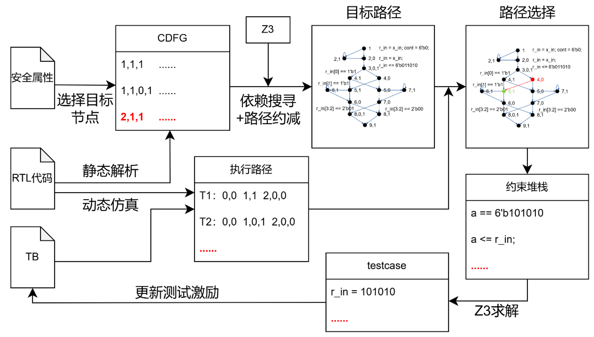

# Concolic Testing Algorithm
---
## 整体框架

### 框架图


### Concolic测试简介框架图解析
Concolic测试引擎目标实现针对特定测试点的自动测试激励生成.它是一种半形式化的验证方法,通过具体执行过程中分析测试的路径到达情况,并通过符号执行到达目标测试点的中间路径分支,以此递归,最终生成多周期的测试激励.

此外,本课题的Concolic测试面向硬件安全测试,主要对象为硬件设计的RTL代码.

框架图解析如下:
- 安全属性:采用自然语言描述或者采用断言等方式表达硬件设计中的安全属性,通常可以归类为机密性与完整性.
- CDFG表达:通过对预处理后的RTL代码进行静态解析,生成控制数据流图(Control Data Flow Graph,CDFG).RTL代码的CDFG表达理论上需包括所有的节点和边,需要处理if-else语句、case语句、不同进程间的数据流、多周期等情况.目前暂未考虑较不常见的for循环情况,可以通过人工转化为常见RTL代码实现.
- 目标路径:目标路径的生成需要一个给定的目标测试点,该点在CDFG中对应一个图的节点.通过该点在CDFG中寻找上级节点与路径,直至到达源节点(没有上级路径).目标路径实质上可以看成针对特定目标测试点的路径模型,该模型表达了从源节点到目标节点的完整路径.
- 执行路径:没什么好说的.表达某一周期程序执行到达的路径节点.一般而言,对于具备并行特征的RTL代码仿真,会同时到达多个路径节点.
- 路径选择:路径选择过程根据执行路径已到达的路径节点,以及已生成的目标路径,去决策期望到达的路径节点.并收集到达下一路径节点的约束条件,以便放进约束求解器中进行求解.
- Z3求解:通过调用Z3求解器对收集的约束进行求解.但Verilog中的条件不能直接用于Z3的约束,而需要对收集的Verilog条件进行符号化,转化为Z3风格的约束.
---

## 关键流程算法

### CDFG生成算法

#### CDFG生成实例
```verilog
module case1 (
    input [7:0] in_1,
    output reg [7:0] out,
    input clk,
    input rst
);

  reg  [3:0] state;
  wire [3:0] st;
  wire [3:0] st2;

  assign st  = state + 4'd2;
  assign st2 = st;

  always @(posedge clk) begin
    if (rst) begin
        state <= 4'h0;
    end else if (in_1 == 8'h26) begin
      state <= 4'h1;
    end else if (in_1 == 8'hf5 && state == 4'h1) begin
      state <= 4'h2;
    end else if (in_1 == 8'h6e && state == 4'h2) begin
      state <= 4'h3;
      //$display("Hooray");
    end else begin
      state <= 0;
    end
  end

  always @(posedge clk) begin
    if (rst) begin
      out <= 8'b0;
    end else if (st2 == 4'h5) begin
      out <= 1; // target node
    end
  end

endmodule
```
执行命令：(Verilog文件在py文件中指定)
```python
python CDFG_1.py
```
```python
[{'0,0': {'condition': '', 'action': "st = state + 4'd2;", 'block_path': ['0,0']}}, {'1,0': {'condition': '', 'action': 'st2 = st;', 'block_path': ['1,0']}}, {'2,1': {'condition': '', 'action': '', 'block_path': ['2,1']}, '2,1,1': {'condition': '(rst)', 'action': "state <= 4'h0;", 'block_path': ['2,1', '2,1,1']}, '2,1,0': {'condition': '!(rst)', 'action': '', 'block_path': ['2,1', '2,1,0']}, '2,1,0,1': {'condition': "(in_1 == 8'h26)", 'action': "state <= 4'h1;", 'block_path': ['2,1', '2,1,0', '2,1,0,1']}, '2,1,0,0': {'condition': "!(in_1 == 8'h26)", 'action': '', 'block_path': ['2,1', '2,1,0', '2,1,0,0']}, '2,1,0,0,1': {'condition': "(in_1 == 8'hf5 && state == 4'h1)", 'action': "state <= 4'h2;", 'block_path': ['2,1', '2,1,0', '2,1,0,0', '2,1,0,0,1']}, '2,1,0,0,0': {'condition': "!(in_1 == 8'hf5 && state == 4'h1)", 'action': '', 'block_path': ['2,1', '2,1,0', '2,1,0,0', '2,1,0,0,0']}, '2,1,0,0,0,1': {'condition': "(in_1 == 8'h6e && state == 4'h2)", 'action': "state <= 4'h3;", 'block_path': ['2,1', '2,1,0', '2,1,0,0', '2,1,0,0,0', '2,1,0,0,0,1']}, '2,1,0,0,0,0': {'condition': "!(in_1 == 8'h6e && state == 4'h2)", 'action': 'state <= 0;', 'block_path': ['2,1', '2,1,0', '2,1,0,0', '2,1,0,0,0', '2,1,0,0,0,0']}}, {'3,1': {'condition': '', 'action': '', 'block_path': ['3,1']}, '3,1,1': {'condition': '(rst)', 'action': "out <= 8'b0;", 'block_path': ['3,1', '3,1,1']}, '3,1,0': {'condition': '!(rst)', 'action': '', 'block_path': ['3,1', '3,1,0']}, '3,1,0,1': {'condition': "(st2 == 4'h5)", 'action': 'out <= 1;', 'block_path': ['3,1', '3,1,0', '3,1,0,1']}}]
```

### 目标路径生成算法

#### 伪代码
```
目标路径搜寻与约束算法
输入:目标节点T,CDFG表达G
输出:目标路径列表
1.	T1 = CDFS(T,G)  // 依赖搜寻T
2.	For t in T1
3.	  If((T,t)为控制依赖)
4.	    搭建约束C=(T的条件,T1的操作),路径P=(T,t)
5.	  Else
6.	    搭建约束C=(T的操作,T1的操作),路径P=(T,t)
7.	Search_P()
8.	
9.	Define Search_P()
10.	For p in P
11.	  T'= CDFS(t,G)
12.	  If((t,T')为控制依赖)
13.	    解约束C,有解则添加路径p
14.	  Else
15.	    添加约束C=C+(T'的操作),路径P=(t,T')
16.	    Search_P()
17.	End Define
```

#### 目标路径生成实例
执行target_path_1.py

目前需要在py文件中手动指定目标节点,设定为'3,1,0,1'时，输出：
```
目标节点块内路径：['3,1', '3,1,0', '3,1,0,1']
目标节点'3,1,0,1'控制依赖信号列表：['st2']
目标节点'3,1,0,1'数据依赖信号列表：[]
所有路径： [['3,1,0,1', '1,0', '1', '1']]
目标节点控制依赖： [['3,1,0,1', '1,0', '1', '1']]
目标节点数据依赖： []
...当前路径1：['3,1,0,1', '1,0', '1', '1']
添加控制流条件约束：
添加控制流条件约束：(st2 == 4'h5)
当前路径约束栈：["(st2 == 4'h5)", 'st2 = st;']
当前路径约束下有解
目标节点'1,0'控制依赖信号列表：[]
目标节点'1,0'数据依赖信号列表：['st']
所有路径： [['1,0', '0,0', '0', '0']]
...当前路径：['1,0', '0,0', '0', '0']
当前路径约束栈：["(st2 == 4'h5)", 'st2 = st;', "st = state + 4'd2;"]
当前路径约束下有解
目标节点'0,0'控制依赖信号列表：[]
目标节点'0,0'数据依赖信号列表：['state']
所有路径： [['0,0', '2,1,1', '0', '0'], ['0,0', '2,1,0,1', '0', '0'], ['0,0', '2,1,0,0,1', '0', '0'], ['0,0', '2,1,0,0,0,1', '0', '0'], ['0,0', '2,1,0,0,0,0', '0', '0']]
...当前路径：['0,0', '2,1,1', '0', '0']
当前路径约束栈：["(st2 == 4'h5)", 'st2 = st;', "st = state + 4'd2;", "state <= 4'h0;"]
当前路径约束下无解,该路径跳过
...当前路径：['0,0', '2,1,0,1', '0', '0']
当前路径约束栈：["(st2 == 4'h5)", 'st2 = st;', "st = state + 4'd2;", "state <= 4'h1;"]
当前路径约束下无解,该路径跳过
...当前路径：['0,0', '2,1,0,0,1', '0', '0']
当前路径约束栈：["(st2 == 4'h5)", 'st2 = st;', "st = state + 4'd2;", "state <= 4'h2;"]
当前路径约束下无解,该路径跳过
...当前路径：['0,0', '2,1,0,0,0,1', '0', '0']
当前路径约束栈：["(st2 == 4'h5)", 'st2 = st;', "st = state + 4'd2;", "state <= 4'h3;"]
当前路径约束下有解
目标节点'2,1,0,0,0,1'控制依赖信号列表：['in_1', 'state']
目标节点'2,1,0,0,0,1'数据依赖信号列表：[]
所有路径： [['2,1,0,0,0,1', '2,1,1', '1', '1'], ['2,1,0,0,0,1', '2,1,0,1', '1', '1'], ['2,1,0,0,0,1', '2,1,0,0,1', '1', '1'], ['2,1,0,0,0,1', '2,1,0,0,0,1', '1', '1'], ['2,1,0,0,0,1', '2,1,0,0,0,0', '1', '1']]
...当前路径：['2,1,0,0,0,1', '2,1,1', '1', '1']
...当前路径：['2,1,0,0,0,1', '2,1,0,1', '1', '1']
...当前路径：['2,1,0,0,0,1', '2,1,0,0,1', '1', '1']
...当前路径：['2,1,0,0,0,1', '2,1,0,0,0,1', '1', '1']
...当前路径：['2,1,0,0,0,1', '2,1,0,0,0,0', '1', '1']
...当前路径：['0,0', '2,1,0,0,0,0', '0', '0']
当前路径约束栈：["(st2 == 4'h5)", 'st2 = st;', "st = state + 4'd2;", "state <= 4'h3;", 'state <= 0;']
当前路径约束下无解,该路径跳过
路径约减结果：3/7
路径搜索结果：[['3,1,0,1', '1,0', '1', '1'], ['1,0', '0,0', '0', '0'], ['0,0', '2,1,0,0,0,1', '0', '0']]        
```
再以目标节点'2,1,0,0,0,1'为目标节点,继续向上搜寻路径
```python
[['3,1,0,1', '1,0', '1', '1'],['1,0', '0,0', '0', '0'],['0,0', '2,1,0,0,0,1', '0', '0'],['2,1,0,0,0,1', '2,1,0,0,1', '1', '1'],['2,1,0,0,1', '2,1,0,1', '1', '1']]
```
添加距离参数
```python
[['3,1,0,1', '1,0', '1', '1', 0],['1,0', '0,0', '0', '0', 1],['0,0', '2,1,0,0,0,1', '0', '0', 2],['2,1,0,0,0,1', '2,1,0,0,1', '1', '1', 3],['2,1,0,0,1', '2,1,0,1', '1', '1', 4]]
```